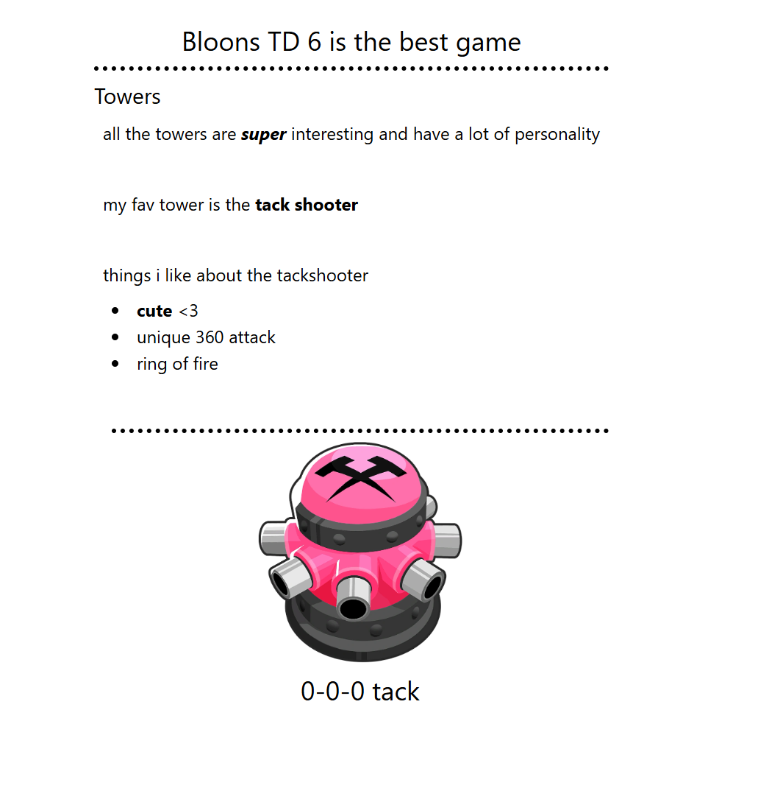

# Marker: **MARK**down Pars**ER** to Build HTML
Reinventing the wheel, but its a fun project and I hope it makes it easier to keep my personal website up to date
## Setup
### Isolate dependencies, install required packages
run `.\<virtual-environment-name>\Scripts\activate`

run `pip install -r requirements.txt`

### Build tailwind

run `npx @tailwindcss/cli -i ./static/styles/input.css -o ./static/styles/output.css --watch`

### Run script with file(s)
run `python main.py your_file.md`

## Example 

